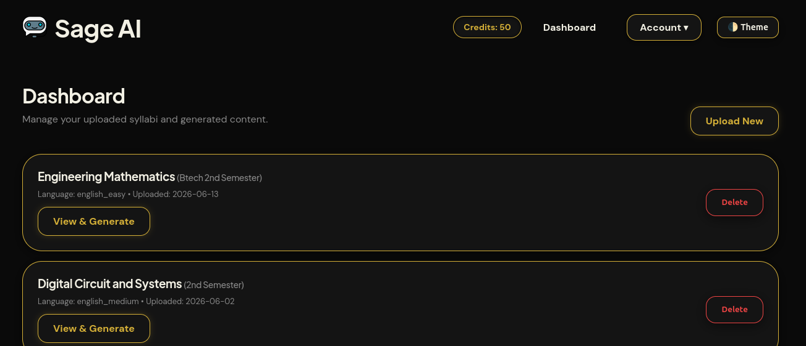
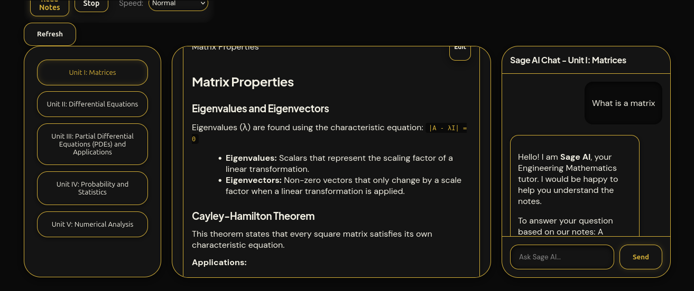
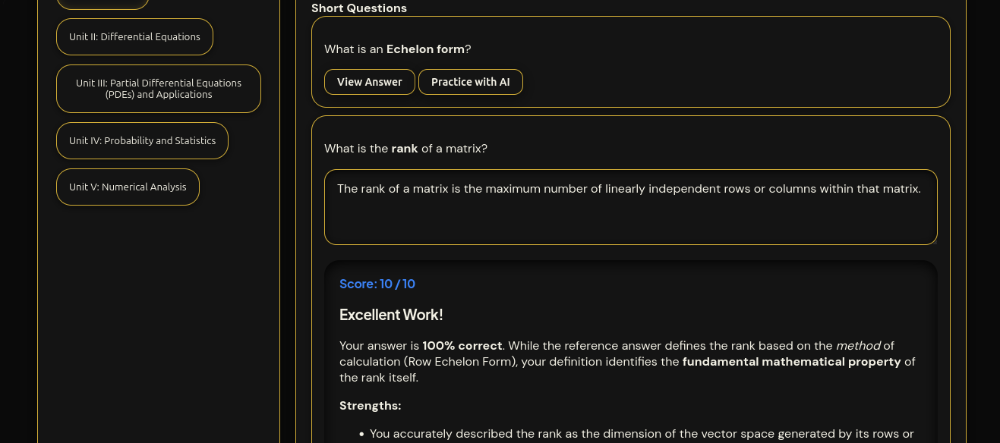

# 🎓 SAGE-AI: Autonomous AI-Powered Study & Curriculum Orchestrator

[](https://sageai.pythonanywhere.com)
[](https://sageai.pythonanywhere.com)
[](#-tech-stack--architecture)

SAGE-AI is a fully automated, production-ready educational platform that transforms raw, unstructured academic syllabi into comprehensive, unit-wise digital classrooms. Designed to eliminate administrative overhead for teachers and maximize retention for students, SAGE-AI ingests massive document inputs and cross-compiles them into structured notes, interactive quizzes, multi-modal study materials, and dynamic revision assets.

🔗 **Live Production URL:** [https://sageai.pythonanywhere.com](https://sageai.pythonanywhere.com)

---

## 🔒 Note on Source Code

> **Internal Repository Status:** **PRIVATE / PROPRIETARY**
>
> To protect proprietary prompt engineering pipelines, architectural orchestration layers, and custom API-handling algorithms, the source code for this repository is kept confidential. 
> 
> However, **the application is 100% complete, fully optimized, and actively deployed.** You can fully evaluate system behavior, UI/UX, database state persistence, and AI intelligence live by logging in with Google at the production link above.

---

## 🚀 Core Architectural Features

### 📂 1. Multi-Format Syllabus Ingestion Engine
* **Asynchronous Parsing:** Seamlessly processes raw text, structured `.docx`, or unstructured complex `.pdf` files using a backend pipeline driven by `PyPDF2`.
* **Two-Step Token Optimization:** Instead of passing massive documents down the chain, SAGE-AI executes a localized pass to extract micro-topics and critical structural nodes, permanently solving token bloat and optimizing inference costs.

### 📝 2. Comprehensive Unit-Wise Knowledge Generation
* **Structured Notes:** Automatically divides the parsed syllabus into explicit academic units, compiling exhaustive deep-dive notes for each topic.
* **Dynamic Document Compilation:** Client-side JavaScript-driven PDF generation allowing instant, single-click exporting of complete unit notes combined with custom practice question sheets, incurring **zero server overhead**.

### 🧠 3. Interactive Evaluation & Adaptive Learning
* **Multi-Tiered Quizzing:** Generates comprehensive Multiple Choice Question (MCQ) quizzes, digital flashcards, and written conceptual questions.
* **AI Practice Mode:** Evaluates student responses to open-ended questions using conversational LLM feedback loops.
* **In-Context Contextual Chat:** A dedicated AI study assistant baked directly into the notes interface to clear up real-time doubts and generate ad-hoc extra practice problems.

### 🎙️ 4. Multi-Modal Content & Rapid Revision
* **Automated Audio Podcasts:** Converts written unit outlines into highly engaging, 5–6 minute audio summary podcasts utilizing hyper-optimized native browser Web Speech API pipelines.
* **10-Minute Rapid Cheat Sheets:** A single-button compilation engine that distills multi-page units into high-impact, 1-to-2 page high-yield rapid revision sheets.
* **Vision-Language Expansion:** Features an "Extra Notes" subsystem powered by multimodal Gemini model processing to instantly generate contextually integrated study guides from uploaded diagrams, textbook snapshots, and external media.

---

## 🛠️ Tech Stack & Architecture

SAGE-AI is engineered for maximum performance, minimal hosting costs, and flawless state management.


```

   [ Client Browser (HTML5/CSS3/Vanilla JS) ]
      │                   ▲             │
Uploads Syllabus          │             │ Web Speech TTS /
& Image Media             │             │ JS PDF Export
      │             JSON Payload        │ (Zero-Server Load)
      ▼                   │             ▼

┌─────────────────────────────┴─────────────────────────────┐
│                      FLASK BACKEND                        │
│                                                           │
│ ┌─────────────────────────┐     ┌───────────────────────┐ │
│ │     Document Parser     │     │   State Management    │ │
│ │       (PyPDF2)          │     │    (SQLite 3)         │ │
│ └───────────┬─────────────┘     └───────────────────────┘ │
│             │                                             │
│             ▼                                             │
│ ┌───────────────────────────────────────────────────────┐ │
│ │        Intelligent Model-Switching Controller         │ │
│ │  (Dynamic Fallbacks / Automatic Rate Limit Shield)   │ │
│ └───────────────────────────┬───────────────────────────┘ │
└─────────────────────────────┼─────────────────────────────┘
▼
[ External Gemini API Cluster ]

```

* **Frontend:** Vanilla HTML5, CSS3, Modern ES6 JavaScript. Clean, responsive, semantic UX built entirely around seamless user interactions.
* **Backend:** Python (Flask). Lightweight, highly modular micro-framework managing routing, secure session authentication via Google OAuth, and secure file streams.
* **Database:** SQLite 3. Lightweight relational schema designed for persistent user-session tracking, generated curriculum state caching, and study-metric tracking.
* **AI Orchestration:** Gemini API Gateway featuring custom fault-tolerant algorithmic model-switching logic.

---

## 🛡️ Engineering Highlights & Challenges Solved

### 🔄 Resilient API Failover (Model-Switching Controller)
**Challenge:** Heavy platform usage risked hitting rigid API token limits or localized endpoint throttling, which would break the active classroom session for the student.
**Solution:** Implemented a proprietary wrapper around the Gemini API client. The system dynamically tracks payload size and API response statuses; if a specific model tier encounters a rate limit or context strain, an automatic, non-blocking fallback mechanism immediately switches tasks to a secondary model cluster, guaranteeing 100% platform uptime.

### 📉 Token Footprint Reduction
**Challenge:** Parsing massive, multi-page syllabus textbooks threatens to trigger LLM token limits and significantly drives up API request latency.
**Solution:** Avoided a naive "read-and-generate-everything" loop. Designed an internal ingestion parser that maps out high-level content metadata first. The platform reduces a 50-page document into a concise structural roadmap, requesting text generation sequentially on a micro-unit basis rather than a single, high-risk context dump.

---

## 📸 Application Preview

Below is a visual walkthrough of the fully deployed SAGE-AI platform:

### User Dashboard & Course Ingestion
> *Upload your PDF, Word document, or paste raw text syllabus files directly into the orchestration manager.*


### Core Unit Classroom View
> *Access your structured notes, chat dynamically with your contents, and generate audio summaries on the fly.*


### Automated Evaluation Matrix
> *Test your comprehension with integrated AI-evaluated MCQs, flashcards, and cheat sheets.*


---

## 📂 Repository Assets Structure

To render the imagery inside this showcase document correctly, please structure your repository's local file tree exactly as shown below:

```text
.
├── README.md               <-- This file
└── assets/                 <-- Create this directory to store graphic assets
    ├── dashboard_preview.png
    ├── classroom_preview.png
    └── evaluation_preview.png
```
