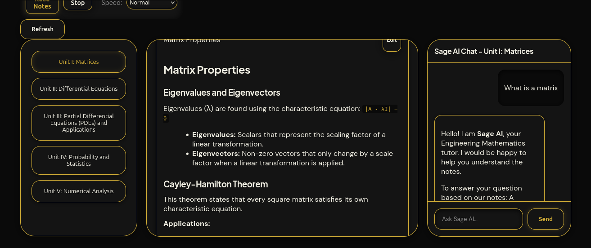
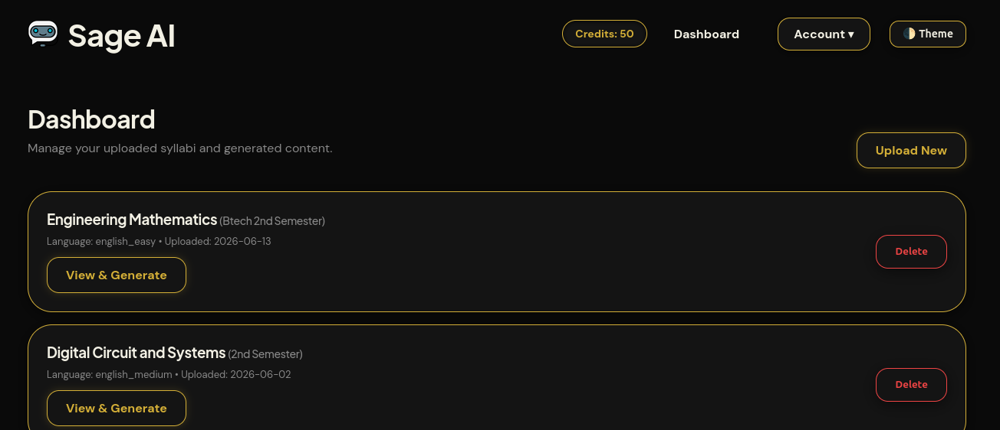
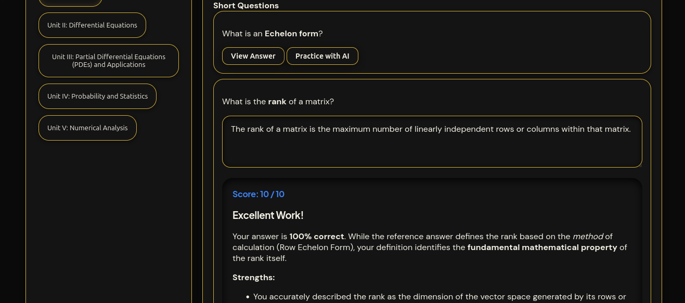

# Sage-AI

An AI-powered document and knowledge assistant built using Python, Flask, and Large Language Models.

## Overview

Sage-AI is a full-stack application designed to process documents, manage information, and provide AI-assisted responses through a structured backend system.

The project focuses on practical integration of LLM APIs, document handling, database management, and modular backend development rather than simply generating text responses.

It was built to explore how modern AI systems can combine traditional software engineering with language models to create useful applications.

## Features

* AI-powered question answering
* Document upload and processing
* LLM API integration
* Persistent chat and data storage
* Flask-based backend
* Structured API architecture
* Database integration
* Context-aware responses
* Modular service-based design
* Error handling and validation

## Tech Stack

### Backend

* Python
* Flask
* REST APIs

### AI / LLM

* Gemini API
* Prompt engineering
* Context management

### Database

* SQLite

### Data Processing

* JSON
* File handling
* Document parsing

### Tools

* Git
* GitHub
* VS Code

## System Workflow

```text
User
   |
   v
Frontend Interface
   |
   v
Flask Backend
   |
   +------ Document Processing
   |
   +------ Database Operations
   |
   +------ LLM API Integration
   |
   v
Generated Response
```

The backend handles request processing, document parsing, database interaction, and communication with the language model API before returning structured responses.

## Project Structure

```text
Sage-AI/
├── app/
│   ├── routes/
│   ├── services/
│   ├── models/
│   ├── templates/
│   └── static/
├── database/
├── uploads/
├── README.md
├── requirements.txt
└── run.py
```

Update the structure according to the final repository.

## Core Components

### Document Processing

Processes uploaded files and extracts relevant information for AI-assisted interactions.

### AI Service Layer

Handles communication with language model APIs and manages prompts, responses, and context.

### Database Layer

Stores user data, chat history, and application information.

### Backend API

Provides structured communication between the frontend and backend.

## Screenshots

### Main Interface

```text

```

### Document Upload

```text

```

### AI Response

```text

```

## What I Learned

Building Sage-AI provided practical experience in:

* Flask application development
* REST API design
* LLM integration
* Prompt engineering
* Document processing
* Database management
* Backend architecture
* File handling
* Error handling and validation
* Structuring modular Python applications

## Future Improvements

* Support for additional document formats
* Better retrieval and context management
* Authentication and user management
* Improved response quality
* More extensive testing
* Advanced search capabilities
* Production deployment

## Status

**Personal Project — Active Development**

Sage-AI is an experimental platform for combining Python backend development, document processing, and modern AI capabilities.

## Author

**Mantra Bareda**

B.Tech — Computer Science & Engineering (Artificial Intelligence)
Mandsaur University

[GitHub](YOUR_GITHUB_URL) · [LinkedIn](YOUR_LINKEDIN_URL)

